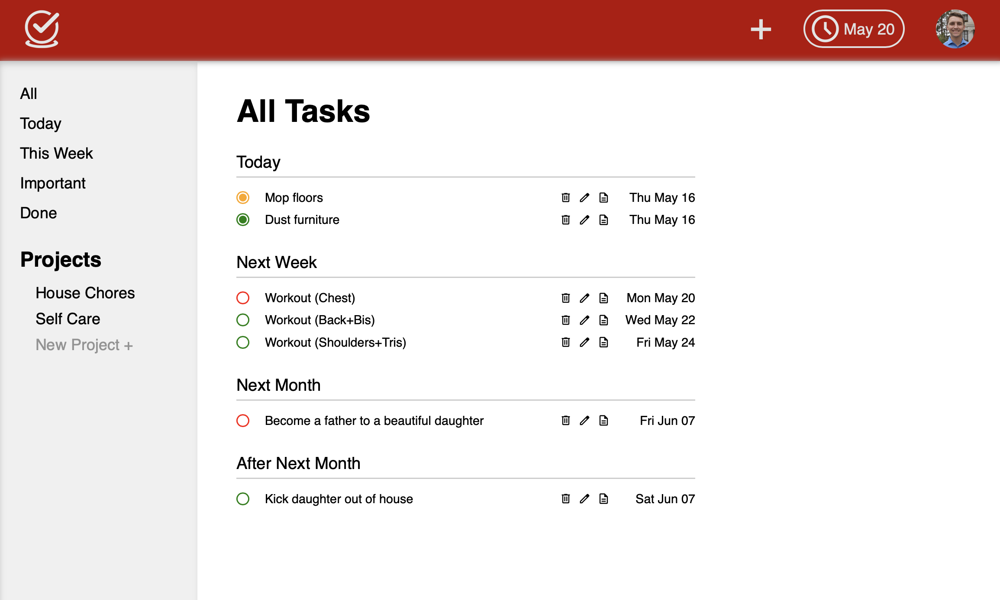

# Todo List

A simple Todo List application built with Vanilla JavaScript, HTML, and CSS.

## Description

This project is a Todo List application that allows users to manage their tasks efficiently. Users can add, edit, delete, and organize tasks into different projects. The application is built completely with vanilla HTML/CSS/JS and utilizes Webpack for module bundling.

## Table of Contents

- [Description](#description)
- [Screenshot](#screenshot)
- [Preview](#preview)
- [Features and Implementation](#features-and-implementation)
- [Installation](#installation)
- [Usage](#usage)
- [Tech Stack](#tech-stack)
- [Dev Notes](#dev-notes)
- [License](#license)
- [Contact Information](#contact-information)

## Screenshot



## Preview

You can view a live preview of the page [here](https://sourdoughbredd.github.io/todo-list/).

## Features and Implementation

### Features

- **Add Tasks**: Users can add new tasks with a description and due date.
- **Edit Tasks**: Tasks can be edited to update their details.
- **Delete Tasks**: Users can delete tasks that are no longer needed.
- **Project Management**: Tasks can be organized into different projects for better management.
- **Task Completion**: Mark tasks as completed or incomplete.
- **Responsive Design**: The application is responsive and works well on different screen sizes.

### Implementation Details

- **src/index.js**: Initializes the application and sets up event listeners. Calls functions to load the header, footer, sidebar, and main content.
- **src/uiControl.js**: Manages the user interface updates and interactions. Functions to load the header, footer, sidebar, and main content.
- **src/task.js**: Manages individual tasks, including creation, editing, and deletion. Functions include `createTask`, `editTask`, and `deleteTask`.
- **src/project.js**: Handles project creation and task organization within projects. Functions include `createProject`, `getProject`, `addTaskToProject`, `deleteTaskFromProject`, and `editTaskInProject`.
- **src/header.js, src/sidebar.js, src/footer.js**: Handle the layout and structure of the application.
- **src/forms.js**: Manages form interactions for adding and editing tasks. Functions include `setupAddTaskForm` and `setupEditTaskForm`.
- **src/style.css**: Contains the styles for the application.
- **src/template.html**: HTML template for the application structure.
- **webpack.config.js**: Configuration file for Webpack.

## Installation

1. Clone the repository:
   ```sh
   git clone https://github.com/sourdoughbredd/todo-list.git
   ```
2. Navigate to the project directory:
   ```sh
   cd todo-list
   ```
3. Install dependencies:
   ```sh
   npm install
   ```
4. Build the project:
   ```sh
   npm run build
   ```
5. Open `dist/index.html` in your preferred web browser.

## Usage

1. Open the application in your web browser.
2. Use the interface to add, edit, delete, and manage your tasks.
3. Organize tasks into different projects for better task management.
4. Mark tasks as completed or incomplete as needed.

## Tech Stack

- HTML
- CSS (CSS Modules)
- JavaScript
- Webpack

### Dev Notes

This project was a labor of love for me. I really focused on creating distinct JS modules for everything (loading DOM elements, task tracking, project tracking, etc.). A lot of time went in to this, and I'm very happy with the end result (though some modules definitely handle more responsibilities than they should). However, it has some quirks. The biggest UX issue a user will quickly notice is that the list of tasks that is currently on the page will not refresh if a new task is created or an existing task is edited. This means if the user edits a task that's on the page, their edits won't show up when they submit the edit. The edits will only show up the next time the user clicks a task view tab (e.g. tab to view today's tasks). This could be quite confusing for a user, who might think their task did not actually update. And this brings me to my biggest regret with this project - not implementing a pub-sub module. This would make it easy to alert the UI module that a task on its page was edited, at which point it would refresh it's page. But a pub-sub module could fix more than just the UX, it could fix the biggest problem I have with the actual code. I took the time (a lot of time) to create all of these distinct modules, but in the end they all became pretty tightly coupled. Sure, things are organized a bit better because of the module structure, but the coupling between them will make this code hard to maintain.

I went into this project without too much planning, which makes me proud of what I accomplished with it. But if I had to do it again, I would plan out the modules more carefully, including how they interface with each other. This is a skill I will continue to hone as I create more projects like this.

## License

This project is licensed under the MIT License.

## Contact Information

For any questions or suggestions, please contact Brett Bussell at [bwbussell24@gmail.com](mailto:bwbussell24@gmail.com).
